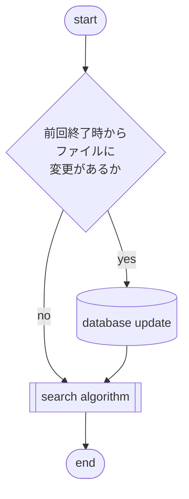
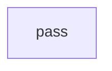

# main algorithm

```mermaid
flowchart TD

start([start]) --> ifchange{前回終了時から\nファイルに\n変更があるか}
ifchange -->|yes| dbupdate[(database update)]
ifchange -->|no| searchloop[[search algorithm]]
dbupdate --> searchloop
searchloop --> e([end])
```

# if change algorithm

```mermaid
flowchart TD

pass
```

# search algorithm

```mermaid
flowchart TD

pass
```
